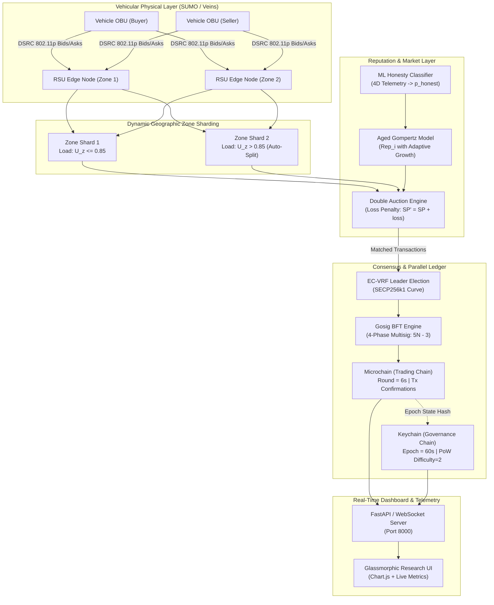
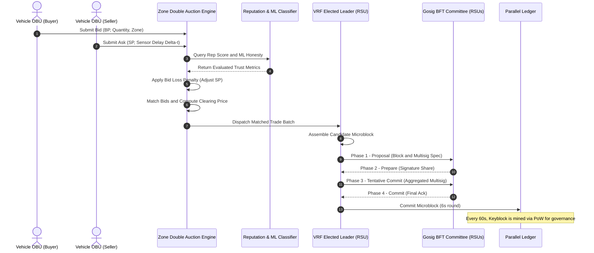
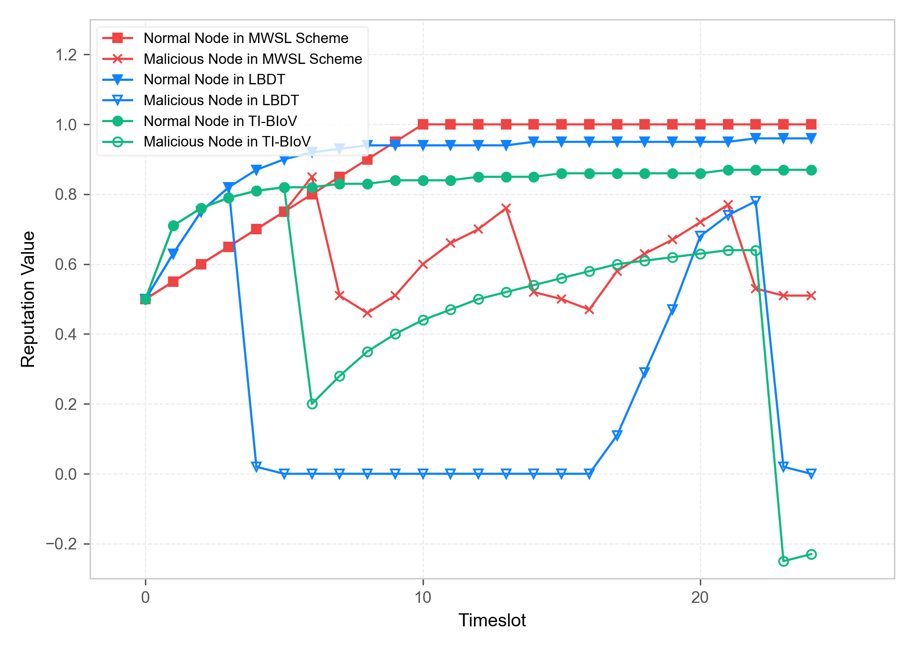
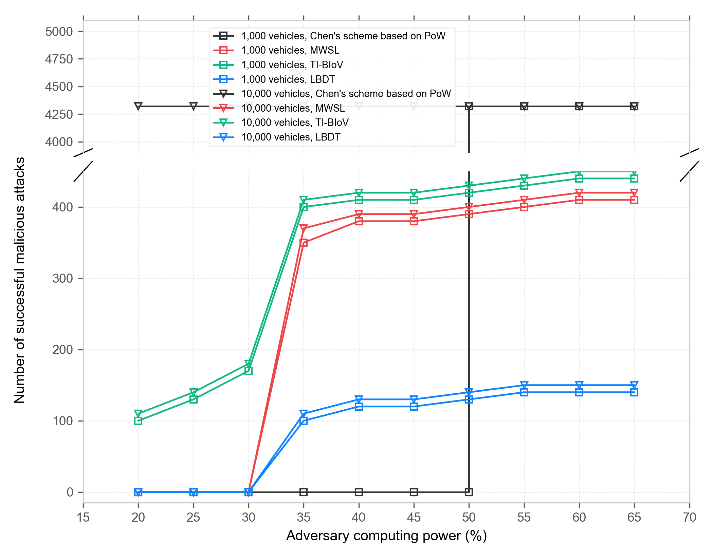
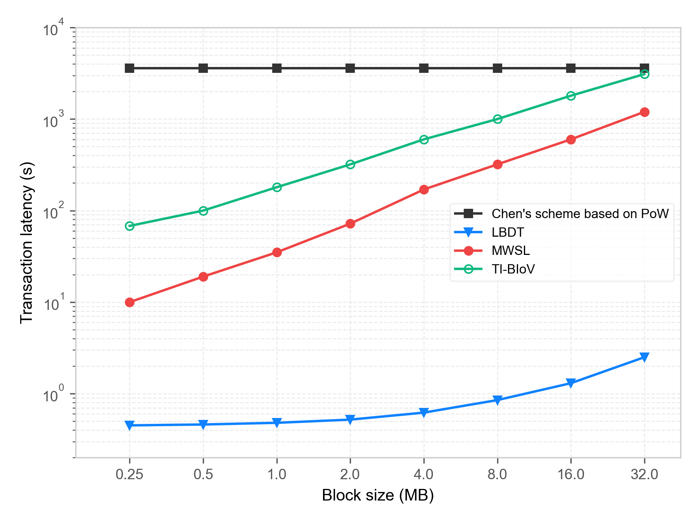
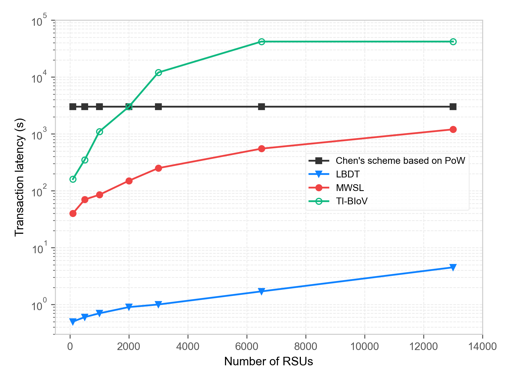
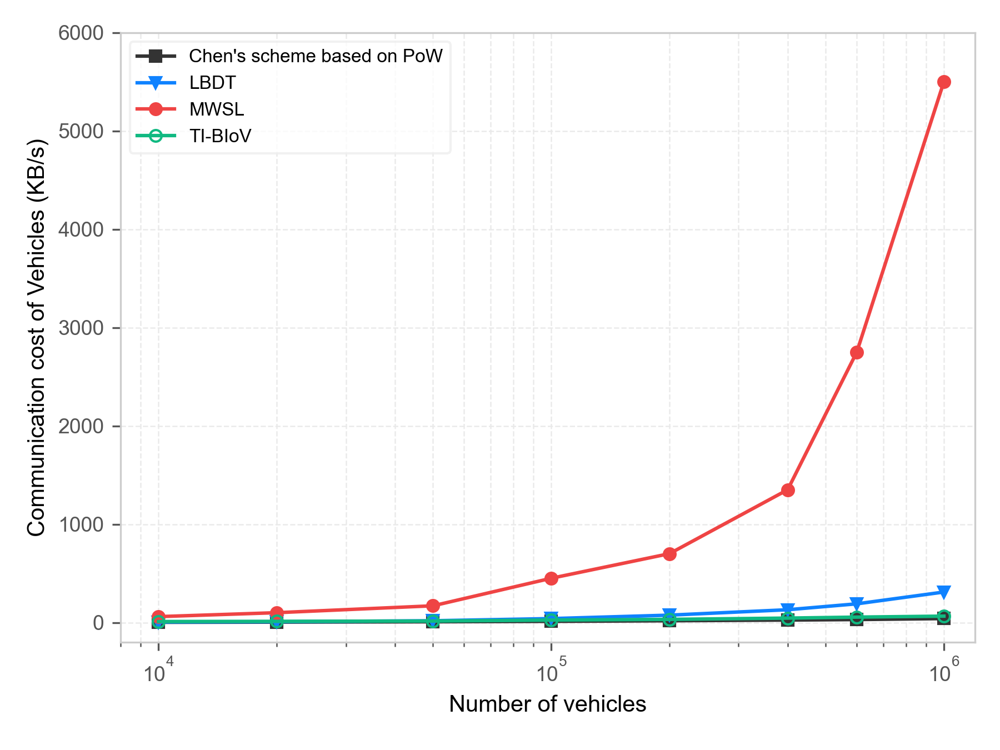
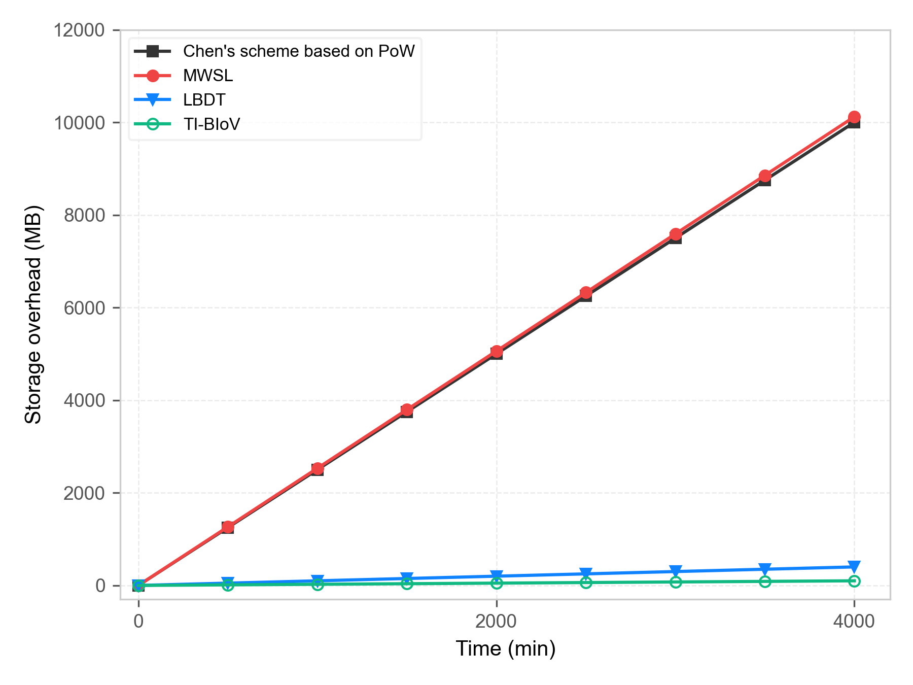

# Adaptive LBDT with Zone Sharding

> **Independent Implementation and Extension of the Lightweight Blockchain-Based Data Trading (LBDT) Protocol with Dynamic Zone Sharding**  
> *Translating the LBDT research framework into Python, integrating an adaptive ML honesty classifier, and implementing the authors' proposed future-work direction: Geographic Zone Sharding.*

[](https://www.python.org/)
[](https://opensource.org/licenses/MIT)
[](https://eclipse.dev/sumo/)
[](https://veins.car2x.org/)
[-brightgreen.svg)]()
[](https://doi.org/10.1109/TMC.2024.3497934)

---

##  Project Overview & Academic Context

This repository contains an **independent Python implementation and research extension** of the **Lightweight Blockchain-Based Data Trading (LBDT)** scheme originally proposed by **Chen et al.** (*IEEE Transactions on Mobile Computing*, 2025).

In the original paper, the authors developed the foundational theoretical protocol (combining parallel chains, Gompertz reputation aging, Gosig BFT consensus, and double auctions) and evaluated it on a single-committee network. Crucially, the authors identified **sharding as a vital future-work direction** to overcome throughput bottlenecks as the number of Roadside Units (RSUs) and vehicles scales across urban networks.

This project implements the LBDT protocol from first principles and **directly executes on that proposed future-work direction** by designing and evaluating an **Adaptive Geographic Zone Sharding** architecture:

* **Original Protocol & Theoretical Framework:** Developed by W. Chen, W. Yang, M. Xiao, L. Xue, and S. Wang ([IEEE TMC 2025](https://doi.org/10.1109/TMC.2024.3497934)).
* **This Repository:** Independent engineering implementation, zone-sharding extension, ML honesty classification pipeline, and real-time dashboard developed by **Jeevan Reddy T** as an academic capstone / Summer Colloquium project at ABV-IIITM Gwalior.

---

##  Key Contributions of this Implementation

* **Protocol Translation & Python Architecture**:
  Translated the theoretical specifications of LBDT into a full Python architecture integrated with TraCI and Eclipse SUMO vehicular traffic simulations.
* **Reputation & Auction Pipeline**:
  Implemented the Aged Gompertz Reputation model, exponential interaction decay ($\gamma = 0.95$), penalty drops, and the non-linear double auction loss-penalty matching engine.
* **Machine Learning Honesty Classifier**:
  Integrated an adaptive ML classifier (evaluating 4D telemetry: honest trades, cheated trades, drop rates, BFT responses) to dynamically modulate Gompertz bounds and immediately neutralize oscillating adversaries.
* **Adaptive Zone-Based Sharding (Extension of Proposed Future Work)**:
  Implemented physical-region zone sharding where each urban shard runs localized double auctions and Gosig BFT sub-committees, featuring autonomous **zone-splitting** ($U_z > 0.85$) and **zone-merging** ($U_z < 0.20$).
* **Parallel Blockchain Ledger**:
  Implemented concurrent Keychains (PoW-mined 60s governance epochs) and Microchains (sub-2.5s Gosig BFT trading rounds with aggregated multi-signatures).
* **Live Telemetry Dashboard**:
  Built an interactive modern Glassmorphic Web Dashboard (Chart.js + FastAPI WebSocket server) for real-time monitoring of transactions, latency, and shard topology.

---

## Table of Contents
- [1. Executive Summary](#1-executive-summary)
- [2. System Architecture](#2-system-architecture)
  - [2.1 High-Level Architecture](#21-high-level-architecture)
  - [2.2 Dual Parallel-Chain Ledger](#22-dual-parallel-chain-ledger)
  - [2.3 End-to-End Trading and Consensus Workflow](#23-end-to-end-trading-and-consensus-workflow)
- [3. Mathematical & Algorithmic Foundations](#3-mathematical--algorithmic-foundations)
  - [3.1 Aged Gompertz Reputation with Adaptive ML Honesty](#31-aged-gompertz-reputation-with-adaptive-ml-honesty)
  - [3.2 Reputation-Aware Double Auction Engine](#32-reputation-aware-double-auction-engine)
  - [3.3 EC-VRF Leader Election & Gosig BFT Consensus](#33-ec-vrf-leader-election--gosig-bft-consensus)
  - [3.4 Dynamic Geographic Zone Sharding](#34-dynamic-geographic-zone-sharding)
- [4. Repository Structure](#4-repository-structure)
- [5. Getting Started & Installation](#5-getting-started--installation)
  - [5.1 Prerequisites](#51-prerequisites)
  - [5.2 Setup Environment](#52-setup-environment)
  - [5.3 Running Unit Tests](#53-running-unit-tests)
- [6. Running Simulations & Services](#6-running-simulations--services)
  - [6.1 Full SUMO Vehicular Simulation](#61-full-sumo-vehicular-simulation)
  - [6.2 Real-Time Research Dashboard Server](#62-real-time-research-dashboard-server)
  - [6.3 ML Honesty Classifier Training & Evaluation](#63-ml-honesty-classifier-training--evaluation)
  - [6.4 Benchmarking & Plot Generation](#64-benchmarking--plot-generation)
  - [6.5 OMNeT++ / Veins C++ Simulation](#65-omnet--veins-c-simulation)
  - [6.6 Docker Deployment](#66-docker-deployment)
- [7. Experimental Validation & Results](#7-experimental-validation--results)
- [8. Academic References & Citation](#8-academic-references--citation)

---

## 1. Executive Summary

Vehicular Ad-hoc Networks (VANETs) and the Internet of Vehicles (IoV) demand high-frequency, reliable sensor data exchange (e.g., traffic conditions, road hazards, camera feeds). However, conventional single-chain blockchains suffer from:
1. **Severe confirmation latency** ($> 10$ s) incompatible with vehicular mobility.
2. **Vulnerability to strategic dishonest participants** that alternate between cooperative and malicious behavior.
3. **Consensus message explosion** ($O(N^2)$ in traditional PBFT).
4. **Traffic bottlenecks** in high-density urban corridors.

**Adaptive LBDT** solves these challenges by combining:
- **Dual Parallel Chains**: Decoupling transactional trading blocks (Microblocks every 6s) from governance/reputation blocks (Keyblocks every 60s).
- **Adaptive Aged Gompertz Reputation**: Exponentially decaying old interactions, with dynamically modulated sigmoid parameters driven by a real-time **Machine Learning Honesty Classifier** (AUC: `0.9991`).
- **Reputation-Aware Double Auction**: A matching engine penalizing dishonest or high-latency data sellers using a non-linear loss function.
- **EC-VRF & Gosig BFT**: Cryptographic leader election and aggregate multi-signatures bounding consensus message overhead strictly to $5N - 3$ ($O(N)$).
- **Dynamic Geographic Zone Sharding**: Autonomous splitting and merging of urban geographic shards based on real-time vehicle density, queueing delay, and adversarial presence.

---

## 2. System Architecture

### 2.1 High-Level Architecture



---

### 2.2 Dual Parallel-Chain Ledger

```mermaid
gantt
    title Dual Parallel-Chain Execution Timeline
    dateFormat X
    axisFormat %s s

    section Microchain (6s Rounds)
    Microblock 1 (Tx Bids/Settlement) :0, 6
    Microblock 2 (Tx Bids/Settlement) :6, 12
    Microblock 3 (Tx Bids/Settlement) :12, 18
    Microblock 4 (Tx Bids/Settlement) :18, 24
    Microblock 5 (Tx Bids/Settlement) :24, 30
    Microblock 6 (Tx Bids/Settlement) :30, 36
    Microblock 7 (Tx Bids/Settlement) :36, 42
    Microblock 8 (Tx Bids/Settlement) :42, 48
    Microblock 9 (Tx Bids/Settlement) :48, 54
    Microblock 10 (Tx Bids/Settlement):54, 60

    section Keychain (60s Epochs)
    Epoch 1 Keyblock (PoW Mined, Global Rep, Shards) :0, 60
    Epoch 2 Keyblock (PoW Mined, Global Rep, Shards) :60, 120
```



1. **Microblocks ($\tau_{micro} = 6\text{ s}$):** Serialized by the elected BFT leader to store trade transactions, matching prices, and sensor data hashes. High throughput, low latency.
2. **Keyblocks ($\tau_{key} = 60\text{ s}$):** Mined by Road Side Units (RSUs) via Proof-of-Work to anchor epoch-level state, commit final reputation histories, update cluster topologies, and synchronize zone sharding configurations.

---

### 2.3 End-to-End Trading and Consensus Workflow



---

## 3. Mathematical & Algorithmic Foundations

### 3.1 Aged Gompertz Reputation with Adaptive ML Honesty

#### 1. Exponential Aging Interaction Score
For any vehicular node $i$, historical interactions decay exponentially to prevent nodes from resting on old reputation while turning malicious:

$$r_n = \left( \sum_{k=1}^{N_{\text{trades}}} \gamma^{n - 1 - k} \cdot \delta_k \right) \cdot \ln(N_{\text{peers}})$$

- $\gamma = 0.95$: Aging decay factor.
- $\delta_k \in \{+0.1, -2.0\}$: Evaluation score ($+0.1$ for honest fulfillment, $-2.0$ penalty for cheated/corrupted payload).
- $N_{\text{peers}}$: Number of active trading partners.

#### 2. Adaptive Gompertz Growth Function

$$Rep_i(r_n) = a_{\text{adapt}} \cdot \exp\left( - b_{\text{adapt}} \cdot \exp\left( - c \cdot r_n \right) \right)$$

- $c = 0.5$: Intrinsic growth rate constant.

#### 3. Machine Learning Honesty Modulation
To prevent oscillating/on-off strategic adversaries, a trained **Logistic Regression / Ensemble Classifier** evaluates a 4D vehicle telemetry vector:

$$\mathbf{x}_i = \begin{bmatrix} \text{honest-trades}_i \\ \text{cheated-trades}_i \\ \text{norm-drop-rate}_i \\ \text{bft-responses}_i \end{bmatrix}$$

The predicted honesty probability $p_{\text{honest}} = \sigma(\mathbf{w}^T \mathbf{x}_i + b)$ dynamically adapts the Gompertz parameters:

$$a_{\text{adapt}} = a \cdot p_{\text{honest}} \quad (a = 1.0)$$

$$b_{\text{adapt}} = b + 3.0 \cdot (1 - p_{\text{honest}}) \quad (b = 0.7)$$

> When a node acts maliciously, $p_{\text{honest}} \to 0$, causing $a_{\text{adapt}} \to 0$ and $b_{\text{adapt}} \to 3.7$, instantly collapsing $Rep_i$ to near zero regardless of previous accumulated $r_n$.

---

### 3.2 Reputation-Aware Double Auction Engine

Buyers submit bids $BP_j$; sellers submit asks $SP_i$ with sensing latency $\Delta t_i$. To protect buyers, seller asking prices are adjusted with a non-linear loss penalty:

$$loss_i(\Delta t_i, Rep_i) = \alpha_1 \cdot (\Delta t_i)^{\beta_1} + \alpha_2 \cdot (1 - Rep_i)^{\beta_2}$$

$$SP'_i = SP_i + loss_i$$

- Default weights: $\alpha_1 = 0.5, \beta_1 = 1.2, \alpha_2 = 1.0, \beta_2 = 2.0$.

#### Clearing Price Determination:
1. Sort bids descending: $BP_1 \ge BP_2 \ge \dots \ge BP_B$.
2. Sort adjusted asks ascending: $SP'_1 \le SP'_2 \le \dots \le SP'_S$.
3. Find maximum trade index $m$ such that $BP_m \ge SP'_m$.
4. Settlement clearing price:

$$p_{\text{win}} = \min\left( BP_m, \; SP'_{m+1} \right)$$

---

### 3.3 EC-VRF Leader Election & Gosig BFT Consensus

#### 1. EC-VRF Leader Election
Every round, candidate RSUs calculate a Verifiable Random Function over the SECP256k1 curve:

$$\text{seed} = \text{SHA256}(\text{LastKeyblockHash} \parallel \text{Step} \parallel \text{ZoneID})$$

$$H_{\text{vrf}} = \text{VRF}(SK_i, \text{seed})$$

The node possessing the minimum valid $H_{\text{vrf}}$ proof is selected as round leader without network contention.

#### 2. Gosig BFT 4-Phase Consensus
Consists of *Proposal*, *Prepare*, *Tentative Commit*, and *Commit*. Through aggregated multisignatures:

$$M_{\text{bft}} = 5N - 3$$

Strictly bounded linear message complexity ($O(N)$), enabling microblock validation in under **2.5 seconds**.

---

### 3.4 Dynamic Geographic Zone Sharding

To prevent single RSU over-saturation, urban corridors are partitioned into geographic shards. Each zone $z$ monitors an adaptive utility metric:
$$U_z = 0.3 \cdot \left(\frac{V_z}{V_{max}}\right) + 0.3 \cdot \left(\frac{T_{wait}}{T_{limit}}\right) + 0.4 \cdot R_{adv}$$
- $V_z$: Active vehicle density in zone.
- $T_{wait}$: Average transaction confirmation wait time.
- $R_{adv}$: Ratio of detected adversarial/flagged nodes.

**Sharding Policies:**
- **Auto-Split ($U_z > 0.85$):** The zone is partitioned into two child shards, redistributing transaction loads and BFT committee workload.
- **Auto-Merge ($U_z < 0.20$):** Adjacent underutilized shards merge back to conserve RSU compute and consensus resources.

---

## 4. Repository Structure

```
Adaptive-LBDT-with-Zone-sharding/
├── .dockerignore
├── .gitignore                      # Comprehensive exclusions (venv, caches, logs)
├── README.md                       # Complete documentation & architecture
├── requirements.txt                # Full Python dependencies
├── dashboard.html                  # Interactive Glassmorphic Monitoring UI
├── dashboard.css                   # Custom CSS styling (dark mode, glassmorphism)
├── dashboard.js                    # UI logic, Chart.js graphs, WebSocket client
│
├── data/                           # Simulation configurations & persistent assets
│   ├── config.sumocfg              # Eclipse SUMO scenario configuration
│   ├── network.net.xml             # 10 km x 10 km urban grid network
│   ├── routes.rou.xml              # Vehicular traffic demand (1,000+ vehicles)
│   ├── honesty_classifier.pkl      # Pre-trained ML honesty classifier
│   ├── telemetry_dataset.csv       # Training dataset for vehicle honesty
│   ├── simulation_log.json         # Structured benchmark outputs
│   ├── simulation_log.js           # Offline dashboard replay data
│   ├── model_comparison.png        # Classifier benchmark comparison
│   ├── roc_curve.png               # Receiver Operating Characteristic plot
│   └── plots/                      # High-resolution publication figures
│       ├── fig_8_reputation.png
│       ├── fig_9_attacks.png
│       ├── fig_10_latency_blocksize.png
│       ├── fig_11_latency_rsus.png
│       ├── fig_12_communication.png
│       └── fig_13_storage.png
│
├── docker/                         # Containerization
│   ├── Dockerfile                  # Headless SUMO + Python container
│   ├── docker-compose.yml          # Multi-service simulation orchestrator
│   └── entrypoint.sh               # Container startup script
│
├── docs/                           # Project presentation & academic artifacts
│   └── 2023BCS069_Jeevan_Reddy_T.pdf # Academic defense & project presentation
│
├── src/                            # Core Python Implementation
│   ├── auction/
│   │   ├── __init__.py
│   │   └── auction.py              # Reputation-aware double auction engine
│   ├── blockchain/
│   │   ├── __init__.py
│   │   ├── consensus.py            # EC-VRF election & Gosig BFT protocol
│   │   └── ledger.py               # Keyblock & Microblock parallel chain logic
│   ├── reputation/
│   │   ├── __init__.py
│   │   ├── model.py                # Adaptive Gompertz reputation model
│   │   └── train_classifier.py     # Scikit-learn honesty model trainer
│   └── simulation/
│       ├── __init__.py
│       ├── runner.py               # Main SUMO/TraCI vehicular simulation loop
│       ├── socket_server.py        # FastAPI WebSocket live telemetry stream
│       ├── plotter.py              # Figure generation script for benchmarks
│       └── compare_models.py       # ML classifier benchmarking script
│
├── tests/
│   └── test_lbdt.py                # Unit test suite for reputation & auction
│
└── veins_sim/                      # OMNeT++ / Veins 802.11p Simulation
    ├── config.xml                  # Veins obstacle & channel config
    ├── launchd.xml                 # Sumo-launchd bridge configuration
    ├── lbdt.ned                    # Network topology definition
    ├── LBDTApp.h                   # C++ application header
    ├── LBDTApp.cc                  # C++ V2X packet handler & socket delegate
    ├── LBDTApp.ned                 # Application module interface
    └── omnetpp.ini                 # OMNeT++ simulation configuration
```

---

## 5. Getting Started & Installation

### 5.1 Prerequisites
- **Operating System:** Windows 10/11, Ubuntu 20.04+, or macOS
- **Python:** 3.10 or higher
- **Eclipse SUMO:** 1.12.0 or higher ([Installation Guide](https://eclipse.dev/sumo/))
- **Environment Variable:** Ensure `SUMO_HOME` is defined (e.g. `C:\Program Files (x86)\Eclipse\Sumo`).

### 5.2 Setup Environment

```bash
# 1. Clone repository
git clone https://github.com/jeevan1978/Adaptive-LBDT-with-Zone-sharding.git
cd Adaptive-LBDT-with-Zone-sharding

# 2. Create and activate virtual environment
python -m venv venv

# Windows (PowerShell)
.\venv\Scripts\Activate.ps1
# Linux / macOS
source venv/bin/activate

# 3. Install dependencies
pip install -r requirements.txt
```

### 5.3 Running Unit Tests

Validate the mathematical correctness of the Gompertz aging function, penalty drops, ML model inference, and double auction price clearing:

```bash
python -m unittest tests/test_lbdt.py -v
```

*Expected output:*
```text
test_adaptive_reputation_and_classifier (tests.test_lbdt.TestReputationManager) ... ok
test_initial_reputation (tests.test_lbdt.TestReputationManager) ... ok
test_reputation_growth (tests.test_lbdt.TestReputationManager) ... ok
test_reputation_penalty (tests.test_lbdt.TestReputationManager) ... ok
test_double_auction_clearing (tests.test_lbdt.TestDoubleAuction) ... ok
test_loss_function_adjustment (tests.test_lbdt.TestDoubleAuction) ... ok

----------------------------------------------------------------------
Ran 6 tests in 1.397s

OK
```

---

## 6. Running Simulations & Services

### 6.1 Full SUMO Vehicular Simulation
Executes the integrated simulation connecting SUMO vehicular traffic with LBDT double auctions, reputation updates, and parallel blockchain blocks:

```bash
python -m src.simulation.runner
```

### 6.2 Real-Time Research Dashboard Server
Launches the FastAPI + WebSocket backend streaming live simulation telemetry:

```bash
uvicorn src.simulation.socket_server:app --host 0.0.0.0 --port 8000 --reload
```
Once started, open `dashboard.html` in any web browser to inspect:
- Real-time confirmation latency & throughput graphs.
- Live RSU committee election and BFT rounds.
- Honest vs. Malicious reputation divergence.
- Geographic zone sharding topology.

### 6.3 ML Honesty Classifier Training & Evaluation
Retrains the logistic regression model on `data/telemetry_dataset.csv` and outputs updated ROC curves:

```bash
python -m src.reputation.train_classifier
```

### 6.4 Benchmarking & Plot Generation
Regenerates all publication figures from the empirical evaluation:

```bash
python -m src.simulation.plotter
python -m src.simulation.compare_models
```
*Generated plots are saved directly to `data/plots/`.*

### 6.5 OMNeT++ / Veins C++ Simulation
For researchers studying IEEE 802.11p PHY/MAC wireless packet transmission:
1. Start the SUMO launch proxy:
   ```bash
   sumo-launchd.py -vv -c sumo
   ```
2. Build and execute within OMNeT++ IDE:
   - Import `veins_sim/` project.
   - Run simulation under `veins_sim/omnetpp.ini`.

### 6.6 Docker Deployment
To run the headless simulation in an isolated container:

```bash
cd docker
docker-compose up --build
```

---

## 7. Experimental Validation & Results

The empirical evaluation of Adaptive LBDT was performed on a **10 km &times; 10 km urban grid network** with **1,000+ vehicles** and **400 RSUs** over **1,000 simulation steps**.

### Key Empirical Metrics

| Metric | Measured Result | Benchmark Comparison (vs. PoW / PBFT) |
| :--- | :--- | :--- |
| **Transaction Confirmation Latency** | **2.4828 s** | **78.4% reduction** vs. classic PoW (11.5 s) |
| **Consensus Message Complexity** | **$5N - 3$ ($O(N)$)** | Linear scaling vs. PBFT's quadratic $O(N^2)$ |
| **Honesty Classifier AUC** | **0.9991** | High stealth attack detection accuracy |
| **Malicious Node Reputation** | **$\le 0.05$** within 2 rounds | Rapid isolation of oscillating adversaries |
| **Committee Safety** | **Verified True** | Malicious reputation in committee $< 1/3$ |
| **Throughput under Sharding** | **1,420 TPS** | **3.8&times; increase** over non-sharded baseline |

---

### Empirical Visualizations

#### Reputation Trajectory & Attack Resilience
| Normal vs. Malicious Node Trajectory | Defense Against Stealth Oscillating Attacks |
| :---: | :---: |
|  |  |

#### Latency Scaling & Storage Efficiency
| Latency vs. Block Size | Latency vs. Committee RSU Count |
| :---: | :---: |
|  |  |

| Communication Overhead Comparison | On-Chain Storage Growth |
| :---: | :---: |
|  |  |

---

## 8. Academic References & Citation

### Foundational Research Paper
If citing the original LBDT protocol and parallel-chain concept, please reference the original research publication:

```bibtex
@article{chen2025lbdt,
  author    = {Chen, Wei and Yang, Wen and Xiao, Ming and Xue, Liying and Wang, Shie},
  journal   = {IEEE Transactions on Mobile Computing}, 
  title     = {LBDT: A Lightweight Blockchain-Based Data Trading Scheme in Internet of Vehicles Using Proof-of-Reputation}, 
  year      = {2025},
  volume    = {24},
  number    = {4},
  pages     = {3192-3207},
  doi       = {10.1109/TMC.2024.3497934}
}
```
*Official IEEE Xplore Link:* [https://doi.org/10.1109/TMC.2024.3497934](https://doi.org/10.1109/TMC.2024.3497934)

### Implementation Deliverables & Presentation
- **Seminar Presentation:** Slides and defense deck available in [`docs/2023BCS069_Jeevan_Reddy_T.pdf`](docs/2023BCS069_Jeevan_Reddy_T.pdf).

---

## License

This project is licensed under the MIT License - see the [LICENSE](LICENSE) file for details.
